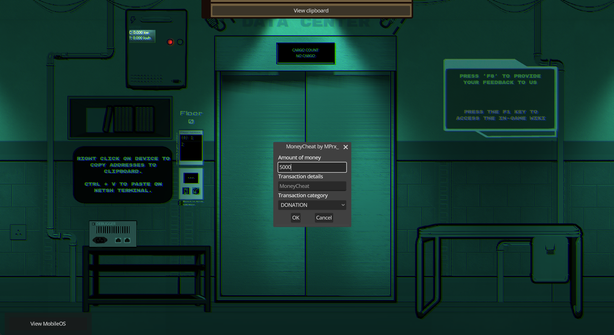
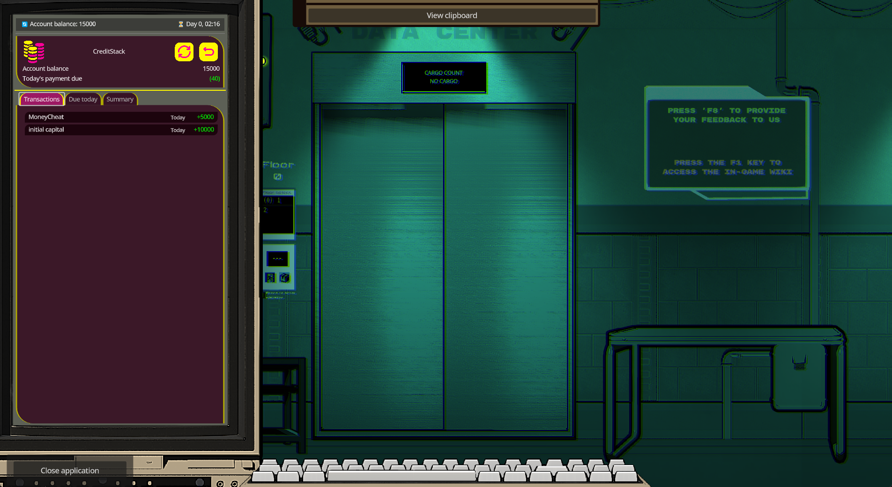

# MoneyCheat

This mod allow you to cheat on money through the game with a little interface.
To open the interface you have to press `F4`.

# Screenshots

  Interface                |  Result
:-------------------------:|:-------------------------:
  |  

# How to install ?

First you will need to get `luajit.elf` from the [Tower-Networking-Inc-modding-kit](https://github.com/treefarmer741/Tower-Networking-Inc-modding-kit) releases and install it in the directory:
- Windows: `%APPDATA%\Godot\app_userdata\Tower Networking Inc\mods`
- Linux: `$HOME/.local/share/godot/app_userdata/Tower Networking Inc/mods`

Then you download the file `entry.lua` in the directory (created by your own):
- Windows: `%APPDATA%\Godot\app_userdata\Tower Networking Inc\mods\mprx_moneycheat`
- Linux: `$HOME/.local/share/godot/app_userdata/Tower Networking Inc/mods/mprx_moneycheat`
